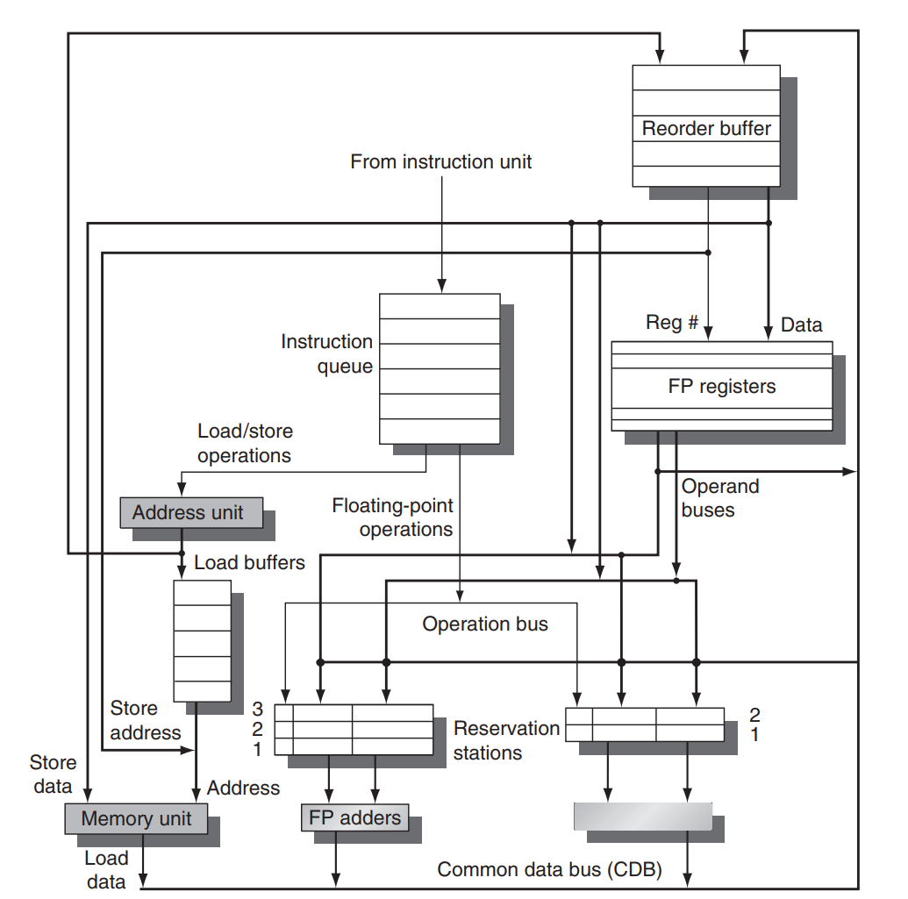

# RISC-V Simulator

A RISC-V RV32I cpu simulator, featuring tomasulo algorithm and hardware speculation.

## Composition

Copied from CAQAA5 (3.6), deleting all units involving FP.

## Procedure

Also copied from CAQAA5 (3.6).

1. **Issue** Get an instruction from the instruction queue. Issue the instruction if there is an empty reservation station and an empty slot in the ROB; send the operands to the reservation station if they are available in either the registers or the ROB. Update the control entries to indicate the buffers are in use. The number of the ROB entry allocated for the result is also sent to the reservation station, so that the number can be used to tag the result when it is placed on the CDB. If either all reservations are full or the ROB is full, then instruction issue is stalled until both have available entries.

2. **Execute** If one or more of the operands is not yet available, monitor the CDB while waiting for the register to be computed. This step checks for RAW hazards. When both operands are available at a reservation station, execute the operation. Instructions may take multiple clock cycles in this stage, and loads still require two steps in this stage. Stores need only have the base register available at this step, since execution for a store at this point is only effective address calculation.

3. **Write Result** When the result is available, write it on the CDB (with the ROB tag sent when the instruction issued) and from the CDB into the ROB, as well
as to any reservation stations waiting for this result. Mark the reservation station as available. Special actions are required for store instructions.

4. **Commit** This is the final stage of completing an instruction, after which only its result remains. There are three different sequences of actions at commit depending on whether the committing instruction is a branch with an incorrect prediction, a store, or any other instruction (normal commit). The normal commit case occurs when an instruction reaches the head of the ROB and its result is present in the buffer; at this point, the processor updates the register with the result and removes the instruction from the ROB. Committing a store is similar except that memory is updated rather than a result register. When a branch with incorrect prediction reaches the head of the ROB, it indicates that the speculation was wrong. The ROB is flushed and execution is restarted at the correct successor of the branch. If the branch was correctly predicted, the branch is finished.

## Usage

### Command format

    simulator [-M mem_block_size] [-A alu_num] [-C cdb_num] [-R rob_num]
    [-P always | alwaysNot | twobit size | local size | gshare size | tournament size]
    [-stat] [input] [-o output]

### Output (-stat)

    106 (Return value)
    559108 (Cpu cycle count)
                    (pred. not jump)   (pred. jump)
    (real not jump) 26924              9144
    (real jump)     5514               26287

## Testcases

Feed *.data into program.